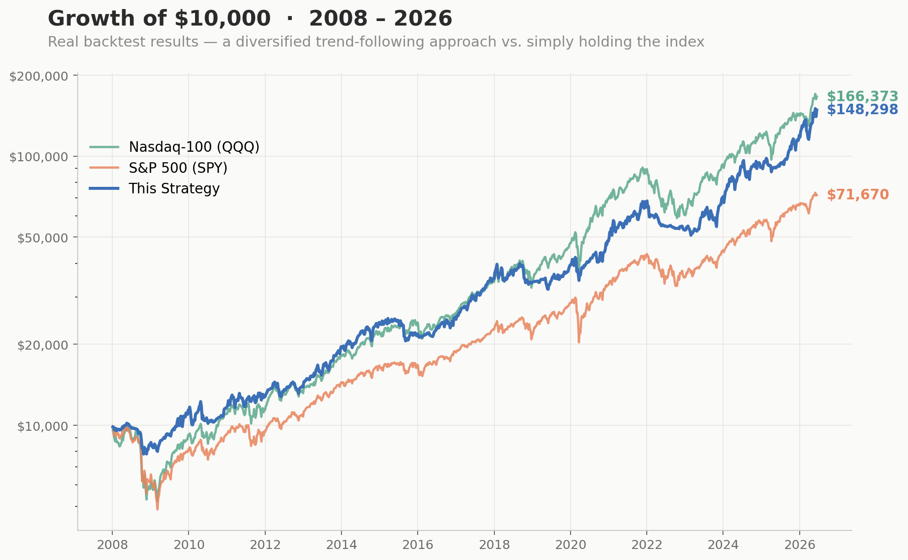
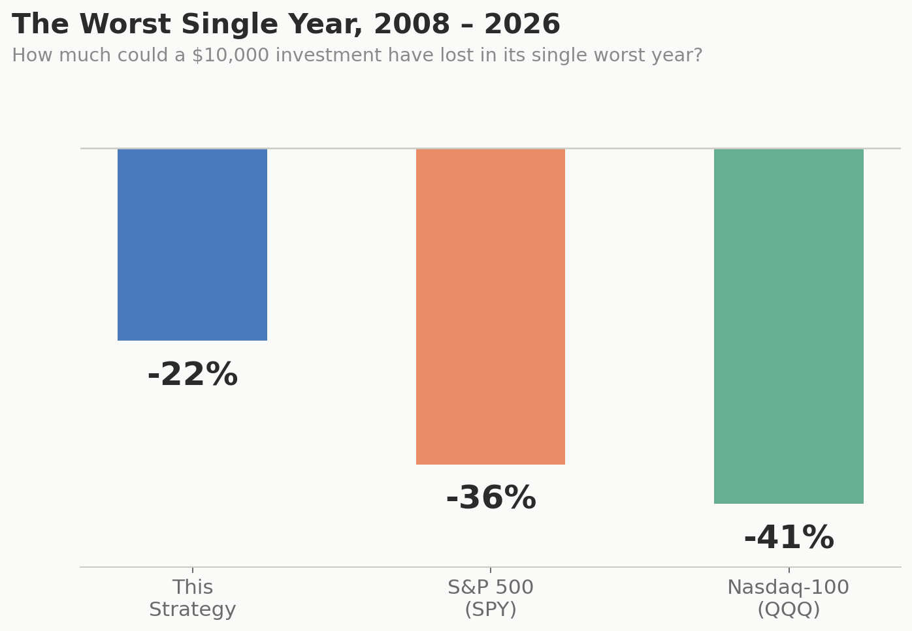
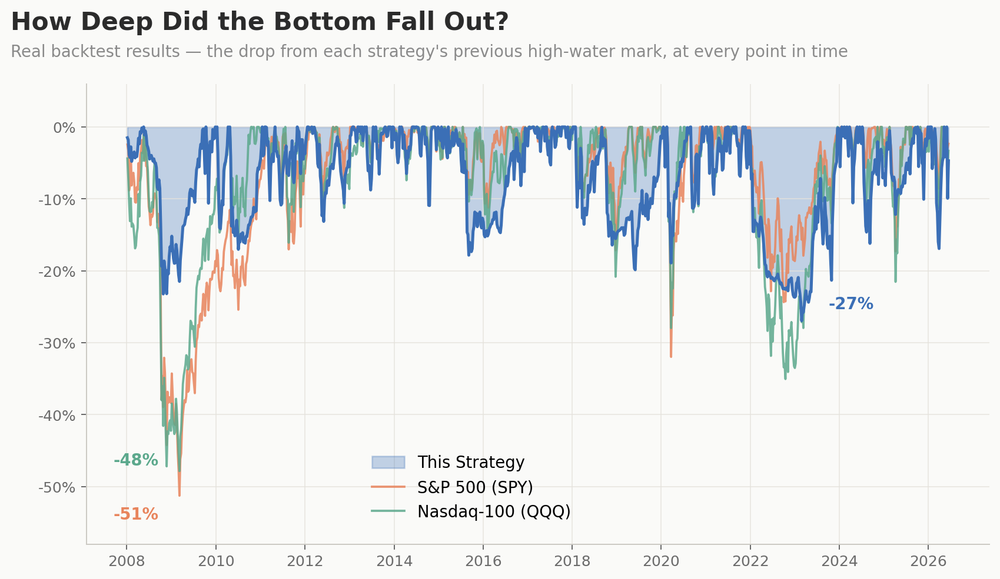
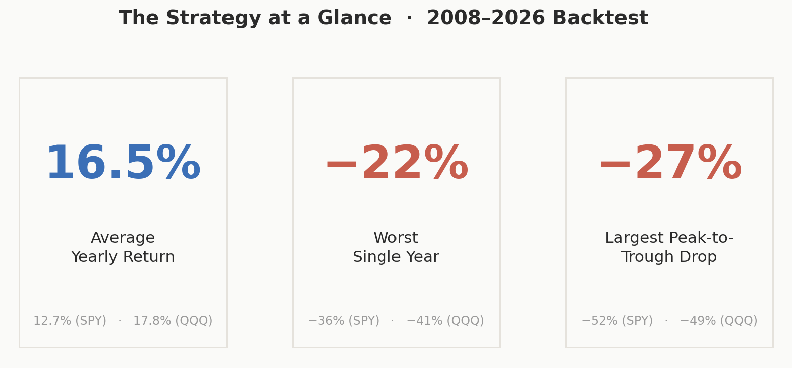
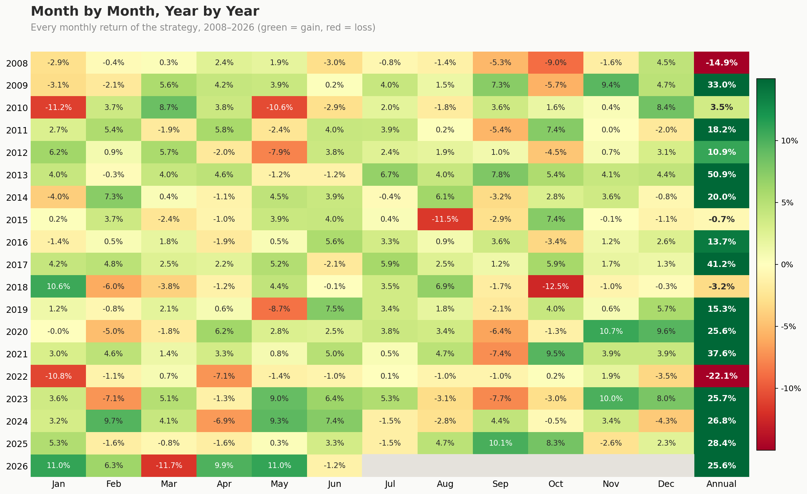
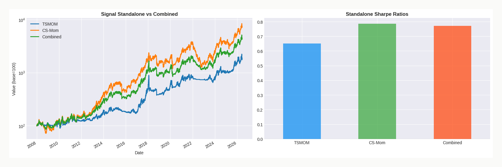
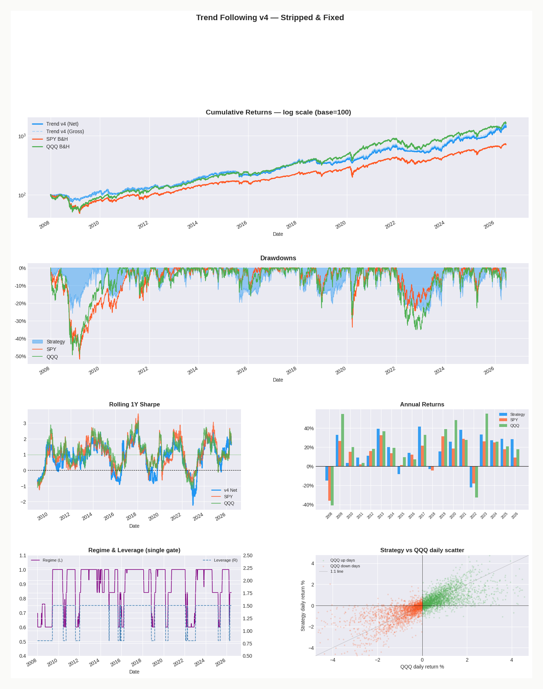

# Building a Smoother Ride: What I Learned Designing a Trend-Following Strategy

> **Paper trading is now live.** The strategy entered its first positions on June 18, 2026 on an Interactive Brokers paper account. Automated daily monitoring and monthly rebalancing are running via Windows Task Scheduler. First rebalance: July 28, 2026. Live results will be added here as data accumulates.
>
> *This README documents the original trend-following strategy and its backtest. The project has since grown into a multi-strategy system — see [Where it goes from here](#where-it-goes-from-here) for the short version, [RESEARCH.md](RESEARCH.md) for the backtest process, results, and rationale behind each addition, [CHANGELOG.md](CHANGELOG.md) for the full history of changes, and [OPERATIONS.md](OPERATIONS.md) for the current technical architecture.*

---

## The idea

Most long-term investing advice boils down to: buy a broad index fund and hold it through the ups and downs. It's reasonable advice. But "the ups and downs" hides a lot. The Nasdaq-100 lost nearly 41% in its worst year over the period I studied. The S&P 500 dropped more than 50% from peak to trough during the 2008 financial crisis. Living through that with a "hold forever" mindset is a lot harder than it sounds on paper, which is exactly why so many people sell at the bottom and miss the recovery.

Trend following takes a different approach. Instead of holding everything all the time, the strategy adjusts how much it owns based on whether prices are generally rising or falling, and how calm or chaotic the market currently feels. The goal isn't to predict crashes. It's to participate in the good times while gradually stepping back during sustained downturns, so the overall ride is less likely to wreck your nerves or your retirement timeline.

I spent a good chunk of time building, testing, and fixing a systematic version of this idea across a mix of ETFs covering US and international stocks, government bonds, gold, and currencies. Below is the full story: what it does, how it performed over eighteen years of history, what went wrong along the way, and who something like this would actually make sense for.

---

## The results

Here's the headline comparison using eighteen years of historical data (2008–2026). There's also an [interactive version](https://isaacnicas.github.io/quant-portfolio/interactive_results.html) of the two charts below where you can hover over any point to see exact values for that month.

A $10,000 investment in 2008 would have grown to roughly $148,000 with this strategy, landing almost exactly between the S&P 500 ($71,670) and the Nasdaq-100 ($166,373). On pure growth, it's competitive with two of the best-performing benchmarks of the last two decades.

But growth alone doesn't tell the real story. Here's the number that matters more:

In the worst calendar year of the entire backtest, this strategy lost 22%. Over the same period, the S&P 500's worst year was a 36% loss and the Nasdaq-100's was 41%. That's roughly half the pain in the worst-case scenario, for a return that's nearly identical to the S&P 500's average.

And it's not just about single bad years. It's about how long and how deep the underwater periods get:

This is sometimes called a drawdown chart, and I think it's the most honest way to look at any investment. It shows, at every single point in time, how far below its previous high point the portfolio sits. The strategy is actually in some kind of drawdown more often than you might expect from the headline numbers alone. That's just the nature of investing; nothing ever goes straight up. What matters is the depth. During the 2008 crisis and the 2020–2022 period, both of which dragged the major indices down by roughly half, the strategy's worst point was a 27% drop. Shallower troughs, and noticeably faster recoveries.

Here's the whole picture in one frame:

The honest summary: you give up a little of the spectacular years in exchange for cutting your worst-case losses roughly in half. Whether that trade-off is worth it depends entirely on how you'd actually feel and behave watching your account drop 40% versus 22%.

---

## The numbers, month by month

If the yearly view feels too zoomed out, here's every single month of the backtest, color-coded green for gains and red for losses:

A few things jump out. 2022 was genuinely the worst year of the whole run at -22.1%, with most of that damage concentrated in January and October. Compare that to 2008, where the loss ended at "only" -14.9% because the strategy had already started pulling back before the worst of the crisis hit.

The green cells noticeably outnumber and outweigh the red ones over eighteen years. Nobody wins every month, but the distribution matters.

## What's actually driving the returns

The strategy blends two different ways of reading the market:

The orange line (CS-Mom, short for cross-sectional momentum) asks a relative question: which of these assets are currently the strongest performers compared to each other? The blue line (TSMOM, time-series momentum) asks an absolute question: is this specific asset trending up or down compared to its own history?

On its own, the relative-strength signal actually outperforms the combined strategy over this period. That might seem like an argument for using it alone, but the time-series signal plays a different role. It's most responsible for recognizing when everything is trending down at once and pulling back across the board. Blending the two gives up a little of the relative-strength signal's raw upside in exchange for that broader downside awareness.

## The actual code output

Here's the full dashboard exactly as the backtest generated it:

---

## What went wrong (more than once) and what it taught me

The version above wasn't the first attempt. It was the result of several rounds of building, testing, finding out something was quietly broken, and fixing it. Two moments stuck with me because the lessons go well beyond backtesting.

**The strategy that was "safe" but barely invested.** An early version looked fantastic at first glance: low volatility, small drawdowns, very smooth returns. The problem was that its actual gains were disappointing, hovering around 2% a year. When I dug in, I found the cause. I had stacked three separate safety mechanisms on top of each other, each one independently designed to reduce risk when markets got choppy. Individually, each made sense. But because they multiplied together rather than working as a team, the strategy might only be 30% invested on a perfectly ordinary day. Three systems being a little cautious each compounded into the portfolio barely participating in anything.

The fix wasn't to rip out the risk controls. It was to simplify three overlapping safeguards into one clear, well-understood rule. That single change took the strategy from 2% a year to over 13%, without making it meaningfully riskier.

The broader lesson: **layered safeguards in any financial product can interact in ways that aren't obvious from looking at each piece separately.** A fund combining several protective overlays might end up far more defensive (or far less) than any single piece suggests. The only way to know is to test how they behave together, under realistic conditions.

**The emergency brake that locked in losses.** I added a circuit breaker: if markets dropped sharply over a short window, the strategy would pull back its exposure as a defensive move. The first version worked technically, but had a subtle flaw. Once it triggered, it stayed defensive until a scheduled monthly check-in, even if markets had already started bouncing back.

In a sharp but short selloff, which happens more often than people expect, this meant the strategy could end up locking in its most defensive position right as the market started recovering, missing the bounce entirely. The fix was to make the strategy listen for signs of recovery every day rather than wait for a calendar date, so it could re-engage as soon as the data supported it.

Both moments taught me the same thing: the gap between a strategy that looks well-designed and one that behaves well-designed comes down to testing how the pieces interact under adversarial scrutiny, not just whether each piece sounds reasonable in isolation.

---

## What this means for the average investor

**If you've ever sold during a crash and regretted it later,** this is the kind of thing that exists for you. The entire premise is reducing how bad the worst years feel. An investor who doesn't panic-sell during a 22% drawdown is going to come out ahead of one who panic-sells during a 40% one, even if the smoother strategy's average return is a touch lower.

**If you're young, have a long time horizon, and genuinely don't check your portfolio during crashes,** a simple index fund might serve you better. Historically, that investor ends up with more money in the Nasdaq-100 than in this strategy, full stop. The smoother ride has a real cost, and if you don't need the smoothing, you're paying for something you don't use.

**The number that matters most isn't the average return. It's the worst year.** A strategy returning 16.5% on average but losing 22% in its worst year is a very different experience to live through than one returning 17.8% on average but losing 41% in its worst year. Averages are what you calculate after the fact. Worst years are what you actually feel while they're happening.

---

## Where this stands now

**Backtesting is complete** across eighteen years of daily price data with realistic trading costs built in.

**Paper trading is live.** The strategy is running on a simulated brokerage account through Interactive Brokers, with positions entered in June 2026. The pipeline runs automatically: prices refresh daily after market close, performance is logged, and the strategy rebalances on the last trading day of each month. The key question paper trading answers that backtesting cannot is whether real fill prices, data feeds, and order execution match the assumptions built into the backtest. Results and a comparison against backtest expectations will be added here as data accumulates.

The original trend-following strategy launched on a five-script execution stack:

- `data_feed.py` — pulls daily price history for all 12 assets from Interactive Brokers
- `signal_engine.py` — computes TSMOM and CS-Mom signals, regime filter, and fast-exit trigger
- `position_sizer.py` — converts signals to target portfolio weights using vol-targeting and exposure caps
- `order_engine.py` — sizes orders in shares, applies the tiered dead-band, and submits to IBKR
- `monitor.py` — logs daily NAV and P&L, saves current weights for the next rebalance

That five-script stack was the starting point. It has since grown — the current architecture is documented in [OPERATIONS.md](OPERATIONS.md).

---

## Where it goes from here

This started as one trend-following strategy. It hasn't stayed that way.

What's documented above is the anchor: the original strategy, its eighteen-year backtest, and the lessons that came out of building it. But a single strategy, however well-tested, is still a single bet. Since taking it live I've been extending the system into a multi-strategy book, adding sleeves that earn their return in different ways and behave differently when markets turn. A mean-reversion sleeve is live. A volatility-premium sleeve and a post-earnings-drift sleeve are built and being staged in. Underneath them sits shared infrastructure: a governance layer that pulls risk when conditions deteriorate, and a portfolio allocator that balances how much each sleeve contributes to overall risk.

The execution stack has evolved alongside the research. The system now runs headless and unattended, rebalances on schedule, and pushes its own results to a live dashboard without me touching it.

I keep a running record of every meaningful change as the project grows. If you want to follow the evolution rather than just the starting point, the research and results behind each addition live in [RESEARCH.md](RESEARCH.md), the full history lives in the [changelog](CHANGELOG.md), and the current technical architecture is documented in [OPERATIONS.md](OPERATIONS.md).

---

*Built using Python, eighteen years of ETF price history, and a fair amount of trial and error.*
